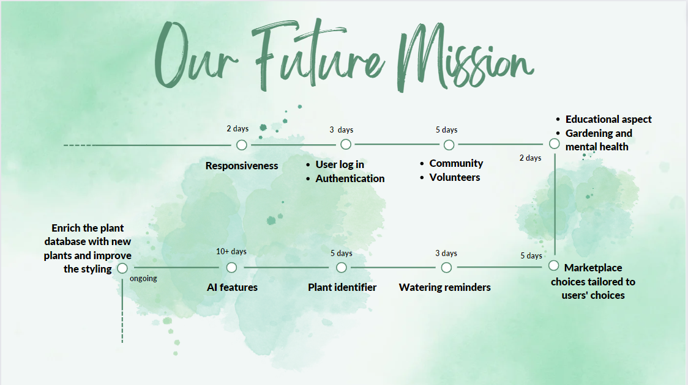

# Garden Genie by M.A.S.H.E.D

## Contents

- [Intro](#intro)
- [Website](#website)
- [Technology](#technology)
- [About](#about)
- [Use](#use)
- [Future Goals](#future-goals)

## Intro

Produced by M.A.S.H.E.D:
<ul>
    <li><a href="https://github.com/MateenSQ">Mateen Qureshi</a></li>
    <li><a href="https://github.com/AnastasiaAdamoudi">Anastasia Adamoudi</a></li>
    <li><a href="https://github.com/saadash1268">Saad Ashraf</a></li>
    <li><a href="https://github.com/h4rsham">Harsham Latif</a></li>
    <li><a href="https://github.com/Pixiebaba">Eric Burns</a></li>
    <li><a href="https://github.com/DeeqaJamalini">Deeqa Jama</a></li>
</ul>

 

Our final 5 week project at the <a href="https://www.schoolofcode.co.uk/">School of Code</a> - the accumulation of everything we learnt and more into a project.

Put into random teams, we spent 2 weeks planning, 2 weeks coding, and a week preparing for presentation and recording.

Presentations to partnership companies and all those interested in our project.

The toughest thing we ever did on the bootcamp - we learnt a lot, debugged a lot and actually laughed a lot!

## Website

You can find the website <a href="https://garden-genie.netlify.app/">here</a>!

## Technology

<ul>
    <li>React.js</li>
    <li>Bootstrap</li>
    <li>CSS</li>
    <li>Testing Library</li>
    <li>Express.js</li>
    <li>Mongoose</li>
    <li>MongoDB</li>
</ul>

## About

We were given the great task of solving any real world problem with an app. A question that brought a lot of discussion - light and heated -c  as everyone in the team had great perspectives on many things we could solve.

Being 12 weeks into the bootcamp, we had spent time learning different concepts not limited to coding but also user & market considerations and teamwork.

Here, we put everything we learned to the test but we didn't use <strong>just</strong> everything we had learnt.

Throughout the bootcamp, we were encouraged to solve problems ourselves, with few pointers from the coaches here and there should the need truly arise.

Here, the coaches left us entirely to our own minds and would provide the same amount of help as if you were to ask on a forum. For this project, they truly let go of our hands.

Struggling with many things - using MongoDB, Next.js and deploying all for the first time, we came to make major calculated decisions regarding our app, such as discontinuing the use of Next.js.

We pulled through, managing to deliver our MVP and more!

## Use

Have you ever wanted to start gardening? Of course you have! Gardening is a gentle and colourful hobby that rewards patience and perseverance. The only problems are that you may not have the time, energy, space, experience or money.

So actually, there can be quite a few problems. You can research and research but that in itself is off putting - so many plants to choose from, which one is right for me? Why is it so hard to start?

But what if there was something, able to give you personalized plant recommendations?

Introducing Garden Genie! You're personalized garden suggestion app - enter what struggles you currently face into the app, pick from a handful of suited plants and gain the required information to start gardening immediately!

Give it a spin: <a href="https://garden-genie.netlify.app/">Garden Genie</a>!

## Future Goals

In our team retrospectives and presentation, we discussed what aspects we would love to see in Garden Genie, from streamlined UI/UX on all devices to blogs and forums.

Take a look:

