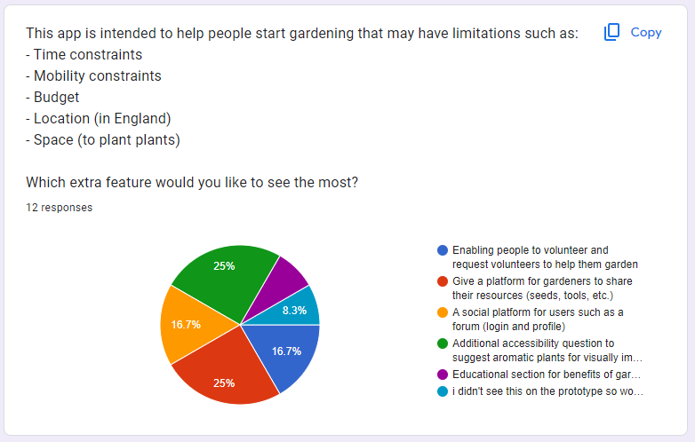
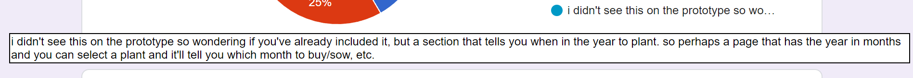

# Garden Genie by M.A.S.H.E.D

## Contents

- [Intro](#intro)
- [Website](#website)
- [Technology](#technology)
- [About](#about)
- [Use](#use)
- [Parts of the Process](#parts-of-the-process)
    - [App Journey](#app-journey)
    - [User Research](#user-research)
        - [Prototyping](#prototyping)
        - [Google Form](#google-form)
    - [Future Goals](#future-goals)
    - [Presentations](#presentations)

## Intro

Produced by M.A.S.H.E.D:
<ul>
    <li><a href="https://github.com/MateenSQ">Mateen Qureshi</a></li>
    <li><a href="https://github.com/AnastasiaAdamoudi">Anastasia Adamoudi</a></li>
    <li><a href="https://github.com/saadash1268">Saad Ashraf</a></li>
    <li><a href="https://github.com/h4rsham">Harsham Latif</a></li>
    <li><a href="https://github.com/Pixiebaba">Eric Burns</a></li>
    <li><a href="https://github.com/DeeqaJamalini">Deeqa Jama</a></li>
</ul>

 

Our final 5 week project at the <a href="https://www.schoolofcode.co.uk/">School of Code</a> - the accumulation of everything we learnt and more into a project.

Put into random teams, we spent 2 weeks planning, 2 weeks coding, and a week preparing for presentation and recording.

Presentations to partnership companies and all those interested in our project.

The toughest thing we ever did on the bootcamp - we learnt a lot, debugged a lot and actually laughed a lot!

## Website

You can find the website here: <a href="https://garden-genie.netlify.app/">Garden Genie</a>!

## Technology

<ul>
    <li>React.js</li>
    <li>CSS</li>
    <li>Bootstrap</li>
    <li>Testing Library</li>
    <li>Express.js</li>
    <li>MongoDB</li>
    <li>Mongoose</li>
</ul>

## About

We were given the great task of solving any real world problem with an app. A question that brought a lot of discussion - light <em>and</em> heated - as everyone in the team had great perspectives on many things we could solve.

Being 12 weeks into the bootcamp, we had spent time learning different concepts not limited to coding but also user & market considerations and teamwork.

Here, we put everything we learned to the test but we didn't use <strong>just</strong> everything we had learnt.

Throughout the bootcamp, we were encouraged to solve problems <strong>ourselves</strong>, with few pointers from the coaches here and there should the need truly arise.

Here, the coaches left us entirely to our own minds and would provide the same amount of help as if you were to ask on a forum. For this project, they stopped holding our hands.

Struggling with many things - using MongoDB, Next.js and deploying all for the first time, we came to make major calculated decisions and AGILE changes, such as discontinuing the use of Next.js.

We pulled through, managing to deliver our MVP and more!

## Use

Have you ever wanted to start gardening? Of course you have! Gardening is a gentle and colourful hobby that rewards patience and perseverance. The only problems are that you may not have the time, energy, space, experience <em>or</em> money.

... So, there can be quite a few problems. You can research and research but that in itself is off putting - so many plants to choose from, which one is right for me? Why is it so hard to start?

But what if there was something, able to give you personalized plant recommendations?

Introducing Garden Genie! You're personalized garden suggestion app - enter what struggles you currently face into the app, pick from a handful of suited plants and gain the required information to start gardening immediately!

Give it a spin: <a href="https://garden-genie.netlify.app/">Garden Genie</a>!

 

# Parts of the Process

## App Journey

So, being tasked with creating an app that solves a problem faced by people in the world. It doesn't get more vague than that!

We started from scratch and we needed a place to document all of our decisions, images, notes - <strong><em>everything</em></strong> - in one place.

Someone on our team presented the extraordinary idea of putting it all on FigJam and to this day I am still amazed of how great of an idea it was! It contains almost everything regarding our plans for the app

In addition to FigJam, to help us remember what we <strong>need</strong> to do but we haven't done yet, we used ol' reliable - Trello! For both our planning to-dos and coding tickets.

Have a look at our app journey - <a href="https://www.figma.com/file/LD9fPLMbpRG8DyJ01LdvsH/Our-Story?type=whiteboard&node-id=413%3A1949&t=MAgttUarJ5M2Y3F4-1">Our Story</a>

It may take you somwhere random in the FigJam, be sure to zoom out, scroll to the top row.

Each week was separated in rows, and the progress in individual weeks (rows) progress from left to right - day 1 to day 5.

(The last week may not have much due there being a shift from planning to coding and presenting)

## User Research

### Prototyping

What our previous project team didn't achieve then we achieved in this project! With a lot more time on our hands, we were given the opportunity to delve deeper into creating a realisitc project that could fit onto the market. This included market research but also user research!

After manufacturing our <a href="https://www.figma.com/file/L83unF1dssVQp78w780aTX/Hi-Fi?type=design&mode=design&t=jMHFKd3ZuRZtb1DK-1">Hi-Fi</a>, we set up prototyping for potential users to interact with. Have a look here: <a href="https://www.figma.com/proto/L83unF1dssVQp78w780aTX/Hi-Fi?type=design&node-id=140-80&scaling=scale-down&page-id=0%3A1&starting-point-node-id=140%3A80&mode=design&t=IHXhBhSWhcJQvKJc-1">prototype</a>.

### Google Form

With prototype in hand we were ready for user research.

Our goals initially were to see if the app was visually appealing to others, if the user flow were intuitive and if the goal of the app was clear but as we were constructing the google form we realised we could do a little more than that.

Have a look at the form here: <a href="https://docs.google.com/forms/d/e/1FAIpQLScSF2fo9bD4RMH9cZ0NZxxz-HUTW9toco39S89Z-UTEeuuesg/viewform?usp=sf_link">here</a>.

We also included a question to help steer our future features to be implemented in the app which looking back was of paramount of importance, the last thing we would want was to add a feature that wasn't anticipated!

 

In addition, we encouraged people to write down their opinions with long answer texts to help us understand what exactly the users were thinking rather than predefined answers. We found some absolutely amazing insights which proved extremely useful, one example is in the image above - the last response, light blue. They detailed as so:

 

In case its unclear, the comment states that it would be nice to include a feature able to overview the months and select plants accordingly. Upon reading this, we realised we hadn't even included when to plant plants in our information section of the app! An essential piece of information that we may have missed otherwise

## Future Goals

In our team retrospectives and presentation, we discussed what aspects we would love to see in Garden Genie, from streamlined UI/UX on all devices to blogs and forums.

Sadly with the time given, these weren't implemented but please, take a look:

## Presentations

We were more than happy to present our hard work to all those who may have been interested.

But the refactor and improvement did not stop at the app. We provided a short video to attract those who may be interested in our app and they may choose to attend our longer presentation.

By this time, we had practice presentations with coaches and found lots of areas to improve upon:

<ul>
    <li>Too long,</li>
    <li>Too much clutter on slides,</li>
    <li>Too much text on slides,</li>
    <li>Missing out worthwhile information.</li>
</ul>

Here is our short video: <a href="https://www.youtube.com/watch?v=Lq3fg9EXW20">short video</a>.

Keeping in mind the long presentation and the short video share the same slides, you can see how we adjusted and improved our presentation to recieve high praise from people in the professional industry.

Final slides: <a href="">here</a>

You may find other things we considered during this project in the slides such as accessability but I've included a lot of things here already and I wouldn't want to clog it up too much!
